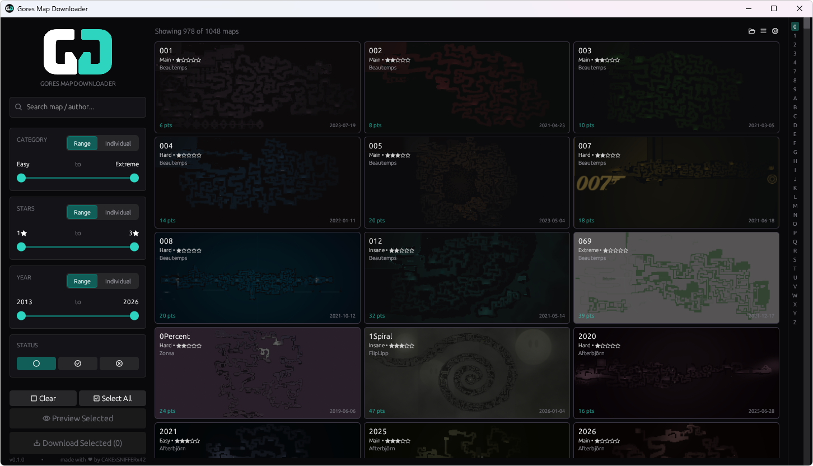
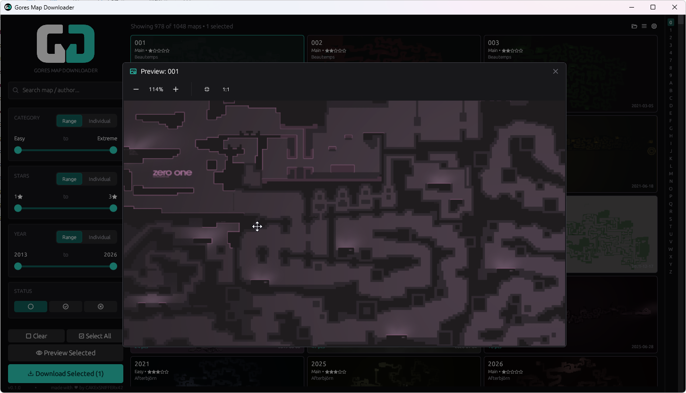

<p align="center">
  
</p>

<h1 align="center">Gores Map Downloader</h1>

<p align="center">
  A fast, fluid Windows desktop application for browsing and downloading Gores maps from DDNet.
</p>

<p align="center">
  
  
  
</p>

---

<p align="center">
  
  <br>
  
</p>

## About

Gores Map Downloader is a native desktop application for browsing, searching, and downloading Gores maps from the DDNet community. Built with Rust and [egui](https://github.com/emilk/egui) for a responsive, GPU-accelerated interface.

## Features

- **Browse** 1000+ Gores maps with full metadata — category, stars, points, author, release date
- **Search** maps by name or author in real time
- **Filter** by category, star rating, year range, and download status
- **Grid & List views** — thumbnail cards or compact sortable table
- **Multi-select** with Ctrl/Shift-click for batch operations
- **Parallel downloads** with progress tracking and cancellation
- **Map previews** — full-resolution preview images with caching
- **Auto-update** — app binary and map database stay current

## Installation

Download the latest release from the [Releases](https://github.com/wtfseanscool/Gores-Map-Downloader/releases) page.

## Building from Source

### Prerequisites

- [Rust](https://rustup.rs) 1.70+

### Build

```bash
cargo build --release
```

The executable will be at `target/release/gores-map-downloader.exe`.

## Project Structure

```
├── src/
│   ├── main.rs              # Entry point and GUI rendering
│   ├── app/                 # Application logic
│   │   ├── mod.rs           # App state and initialization
│   │   ├── filters.rs       # Search and filter logic
│   │   ├── downloads.rs     # Download management
│   │   ├── thumbnails.rs    # Thumbnail caching
│   │   ├── updates.rs       # Auto-update system
│   │   ├── context_menu.rs  # Shared context menus
│   │   ├── views.rs         # View mode helpers
│   │   └── modals.rs        # Modal dialogs
│   ├── ui/                  # Reusable UI components
│   │   ├── mod.rs
│   │   └── components.rs
│   ├── theme.rs             # Colors and styling
│   ├── constants.rs         # URLs and configuration
│   ├── db.rs                # SQLite database
│   ├── settings.rs          # User preferences
│   ├── types.rs             # Shared types
│   └── utils.rs             # Utility functions
├── assets/                  # Icons and fonts
├── Cargo.toml               # Dependencies
└── build.rs                 # Build script
```

## Credits

- Map previews generated with [twgpu](https://crates.io/crates/twgpu)

## License

This software is source-available. See [LICENSE](LICENSE) for details.
